# Automated Model Management Protocol

## TL;DR

**Goal**: Create a highly resilient, automated model management system that ensures available models and selectable models are always synchronized with the latest from all connected providers.

**Deliverables**:
1. Automated model discovery pipeline (6 providers → unified catalog)
2. Two-tier caching system (L1 in-memory, L2 persistent)
3. Model lifecycle state machine (detected → assessed → approved → selectable → default)
4. Automated PR generation for new/updated models
5. Dashboard integration with real-time lifecycle badges
6. CI/CD workflow for continuous catalog synchronization

**Estimated Effort**: Large (40-60 hours across 8 waves)
**Parallel Execution**: YES - 8 waves with critical path through Provider Adapters → State Machine → PR Automation
**Critical Path**: Wave 1 (Adapters) → Wave 2 (Discovery) → Wave 5 (State Machine) → Wave 7 (PR Automation) → Wave 8 (Integration)

---

## Context

### Original Request
Create a comprehensive model management protocol that ensures opencode always has the latest models from all connected providers. The system should automatically discover, validate, assess, and integrate new models with minimal human intervention while maintaining safety and reliability.

### Current System Analysis
**Existing Infrastructure**:
- `packages/opencode-model-router-x/src/model-discovery.js` - Provider API polling (6 providers, unreferenced)
- `opencode-config/models/schema.json` - Central model metadata schema (v1.0.0, lastUpdated 2026-02-15)
- `opencode-config/models/catalog-2026.json` - 19 models across 5 providers
- `scripts/validate-models.mjs` - Cross-file validation (12 files, forbidden patterns, release window checks)
- `scripts/weekly-model-sync.mjs` - Weekly validation + schema age check
- `.github/workflows-disabled/model-catalog-sync.yml` - DISABLED CI workflow
- `packages/opencode-model-router-x/src/new-model-assessor.js` - 5-phase assessment (simulated benchmarks)
- Dashboard model matrix UI with 30s polling

**Identified Gaps**:
1. Discovery-to-catalog pipeline incomplete (detection exists, auto-update doesn't)
2. ModelDiscovery/NewModelAssessor not wired to active runtime
3. CI workflow disabled
4. Multiple truth sources (policies.json, opencode.json, catalog-2026.json, strategies)
5. Static pricing/tables drift quickly
6. Anthropic uses hardcoded list (no API polling)
7. No automated PR creation for new models
8. Manual intervention required for all updates

### Research Findings
**Industry Best Practices** (from Claude Code, Continue.dev, LiteLLM, OpenWebUI):
- Provider adapters with common interface (list/get/normalize)
- Two-tier caching (L1: 5m TTL in-memory, L2: 1h TTL persistent)
- Stale-while-revalidate pattern
- Lifecycle states: active | deprecated | retired | blocked
- Capability metadata normalization (independent of provider payload)
- Snapshot/diff pipeline for change detection
- Poll intervals vary by provider (OpenAI 60m, Anthropic 30m, Gemini 30m)

### Metis Review Findings
**Critical Questions Addressed**:
- State machine with hard gates: detected → assessed → approved → selectable → default
- Policy immutability: automation updates catalog only, routing policy changes require approval
- Safe rollout: shadow traffic + canary + automatic rollback triggers
- Auditability: signed provenance for every transition (source, timestamp, payload hash)
- Circuit breakers: provider outage, malformed metadata, anomalous pricing
- Scope boundaries: catalog freshness only (excludes router optimization, prompt tuning, benchmark redesign)

---

## Work Objectives

### Core Objective
Build an autonomous model management pipeline that discovers models from 6 providers, normalizes metadata, enforces a 5-state lifecycle, and generates pull requests for human approval - all while maintaining zero-downtime updates and complete audit trails.

### Concrete Deliverables

| Deliverable | Location | Description |
|-------------|----------|-------------|
| Provider Adapter Framework | `packages/opencode-model-manager/src/adapters/` | 6 provider adapters with common interface |
| Discovery Engine | `packages/opencode-model-manager/src/discovery/` | Coordinated polling with circuit breakers |
| Cache Layer | `packages/opencode-model-manager/src/cache/` | Two-tier caching with stale-while-revalidate |
| State Machine | `packages/opencode-model-manager/src/lifecycle/` | 5-state model lifecycle engine |
| Diff Engine | `packages/opencode-model-manager/src/diff/` | Snapshot comparison and change classification |
| PR Automation | `packages/opencode-model-manager/src/pr/` | Automated PR generation with templates |
| Dashboard Integration | `packages/opencode-dashboard/src/app/models/` | Lifecycle badges and approval UI |
| CI Workflow | `.github/workflows/model-catalog-sync.yml` | Enabled production workflow |
| Documentation | `docs/model-management/` | Architecture, API, operational runbooks |

### Definition of Done
- [ ] All 6 provider adapters implemented and tested
- [ ] Discovery engine runs on configurable schedule (no CI disabled state)
- [ ] State machine enforces all 5 transitions with audit logging
- [ ] Automated PRs created for new models with risk scoring
- [ ] Dashboard shows real-time model lifecycle status
- [ ] CI workflow runs weekly + on-demand without failures
- [ ] 100% backward compatibility with existing model references
- [ ] Rollback capability < 5 minutes for any change

### Must Have
- Provider adapters for: OpenAI, Anthropic, Google, Groq, Cerebras, NVIDIA
- Two-tier caching with configurable TTL
- 5-state lifecycle: detected → assessed → approved → selectable → default
- Automated PR generation with detailed changelogs
- Complete audit trail (source endpoint, timestamp, payload hash, approver)
- Circuit breakers for provider failures
- Dashboard integration for lifecycle visibility
- Backward compatibility with all existing model references

### Must NOT Have (Guardrails)
- Automatic updates to routing policies without approval
- Direct mutation of production catalog without PR
- Deletion of models from catalog without human confirmation
- Automatic promotion to "default" status
- Co-delivery with router optimization (separate concern)
- Support for providers beyond the current 6 (MVP scope)
- Real-time streaming updates (use polling only)

---

## Verification Strategy

### Test Decision
- **Infrastructure exists**: YES - Bun test setup present
- **Automated tests**: YES (Tests-after) - Unit tests for adapters, integration tests for pipeline
- **Framework**: Bun test (built-in)

### Agent-Executed QA Scenarios

#### Scenario 1: OpenAI Adapter Fetches Models Successfully
```yaml
Tool: Bash (curl)
Preconditions: Valid OPENAI_API_KEY in environment
Steps:
  1. Run: node -e "const adapter = require('./packages/opencode-model-manager/src/adapters/openai'); const models = await adapter.list(); console.log(JSON.stringify(models, null, 2));"
  2. Assert: Array with >10 models returned
  3. Assert: Each model has id, provider, contextTokens, outputTokens
  4. Assert: No errors in stderr
Expected Result: JSON array of normalized model objects
Evidence: Terminal output captured
```

#### Scenario 2: Cache Hit Returns Stale Data with Background Refresh
```yaml
Tool: Bun test
Preconditions: Cache populated with 5-min old data, provider accessible
Steps:
  1. First call to cache.get() returns cached data immediately
  2. Background fetch triggered automatically
  3. Second call after background completes returns fresh data
Expected Result: No blocking on provider API, data eventually consistent
Evidence: Test output with timing logs
```

#### Scenario 3: New Model Detection Triggers PR Creation
```yaml
Tool: Bash (node script)
Preconditions: Test provider with known model list + 1 new model
Steps:
  1. Run discovery engine with test provider
  2. Detect new model "gpt-test-99"
  3. State machine transitions: detected → assessed → approved (auto)
  4. PR created with title: "[AUTO] New model: gpt-test-99 from OpenAI"
  5. PR body contains: model metadata, diff, risk score, approval checklist
Expected Result: PR #xxx created with correct content
Evidence: PR URL and content captured
```

#### Scenario 4: Dashboard Shows Lifecycle Badge
```yaml
Tool: Playwright
Preconditions: Dashboard running, model in "assessed" state
Steps:
  1. Navigate to http://localhost:3000/models
  2. Locate model card for "gpt-test-99"
  3. Assert: Badge shows "Assessed" with yellow color
  4. Click on model card
  5. Assert: Modal shows full lifecycle history and transition actions
Expected Result: UI renders correctly with lifecycle state visible
Evidence: Screenshot at .sisyphus/evidence/lifecycle-badge.png
```

#### Scenario 5: Circuit Breaker Opens on Provider Failure
```yaml
Tool: Bun test
Preconditions: Provider adapter with simulated 5xx responses
Steps:
  1. Configure provider to return 500 errors
  2. Make 5 requests through adapter
  3. Assert: Circuit breaker opens after threshold
  4. Assert: Subsequent requests fail fast with circuit open error
  5. Wait for timeout period
  6. Assert: Circuit transitions to half-open
  7. Assert: Successful request closes circuit
Expected Result: Circuit breaker state transitions correctly
Evidence: Test output showing state machine transitions
```

#### Scenario 6: Rollback Restores Previous Catalog State
```yaml
Tool: Bash
Preconditions: Catalog updated, backup exists
Steps:
  1. Run: node scripts/model-rollback.mjs --to-last-good
  2. Assert: catalog-2026.json restored to previous version
  3. Assert: validate-models.mjs passes
  4. Assert: Dashboard shows previous model list
Expected Result: Clean rollback in < 5 minutes
Evidence: File diff showing restoration
```

---

## Execution Strategy

### Parallel Execution Waves

```mermaid
flowchart LR
    subgraph Wave1["Wave 1: Foundation"]
        A1[Provider Adapters]
    end
    
    subgraph Wave2["Wave 2: Discovery"]
        B1[Discovery Engine]
        B2[Cache Layer]
    end
    
    subgraph Wave3["Wave 3: Storage"]
        C1[Snapshot Store]
        C2[Diff Engine]
    end
    
    subgraph Wave4["Wave 4: Assessment"]
        D1[Benchmark Runner]
        D2[Metrics Collector]
    end
    
    subgraph Wave5["Wave 5: Lifecycle"]
        E1[State Machine]
        E2[Audit Logger]
    end
    
    subgraph Wave6["Wave 6: Integration"]
        F1[Dashboard API]
        F2[Dashboard UI]
    end
    
    subgraph Wave7["Wave 7: Automation"]
        G1[PR Generator]
        G2[CI Workflow]
    end
    
    subgraph Wave8["Wave 8: Hardening"]
        H1[Monitoring]
        H2[Rollback]
        H3[Docs]
    end
    
    Wave1 --> Wave2 --> Wave3 --> Wave4 --> Wave5 --> Wave6 --> Wave7 --> Wave8
```



### Wave Details

| Wave | Tasks | Can Parallelize | Blocked By | Duration Est. |
|------|-------|-----------------|------------|---------------|
| Wave 1 | Provider Adapters (6) | Within wave: YES | None | 8 hours |
| Wave 2 | Discovery Engine, Cache | Within wave: YES | Wave 1 | 6 hours |
| Wave 3 | Snapshot Store, Diff Engine | Within wave: YES | Wave 2 | 4 hours |
| Wave 4 | Benchmark Runner, Metrics | Within wave: YES | Wave 3 | 6 hours |
| Wave 5 | State Machine, Audit Logger | Within wave: YES | Wave 4 | 8 hours |
| Wave 6 | Dashboard API, UI | Within wave: YES | Wave 5 | 8 hours |
| Wave 7 | PR Generator, CI Workflow | Within wave: YES | Wave 6 | 6 hours |
| Wave 8 | Monitoring, Rollback, Docs | Within wave: YES | Wave 7 | 4 hours |

### Critical Path
Wave 1 (Adapters) → Wave 2 (Discovery) → Wave 5 (State Machine) → Wave 7 (PR Automation) → Wave 8 (Hardening)

---

## TODOs

### Wave 1: Provider Adapter Framework

- [x] **1.1 Create Provider Adapter Interface**
  **What to do**:
  - Define common adapter interface: `list()`, `get(id)`, `normalize(raw)`, `getCapabilities(model)`
  - Create base adapter class with error handling, retry logic, circuit breaker integration
  - Document interface in JSDoc
  
  **Must NOT do**:
  - Implement provider-specific logic here (keep abstract)
  - Add caching at this layer (handled separately)
  
  **Recommended Agent Profile**:
  - **Category**: `ultrabrain` - Complex interface design
  - **Skills**: `opencode-model-router-x` - Domain knowledge of existing router patterns
  
  **Parallelization**:
  - **Can Run In Parallel**: NO (foundation for all others)
  - **Blocks**: Tasks 1.2-1.7, Wave 2, Wave 3
  
  **References**:
  - `packages/opencode-model-router-x/src/model-discovery.js:12-45` - Provider configs
  - `packages/opencode-model-router-x/src/model-discovery.js:158-201` - Fetch logic to abstract
  - LiteLLM adapter patterns (external): `https://github.com/BerriAI/litellm`
  
  **Acceptance Criteria**:
  - [ ] Interface defined with TypeScript/JSDoc
  - [ ] Base class handles auth, timeout, error normalization
  - [ ] Unit test: mock adapter implements interface correctly
  - [ ] `bun test packages/opencode-model-manager/test/adapter-interface.test.ts` → PASS

- [x] **1.2 Implement OpenAI Adapter**
  **What to do**:
  - Implement adapter for OpenAI API: `GET /v1/models`
  - Handle pagination, rate limits, auth (Bearer token)
  - Normalize response to common schema
  
  **Recommended Agent Profile**:
  - **Category**: `quick` - Straightforward implementation
  - **Skills**: None required
  
  **Parallelization**:
  - **Can Run In Parallel**: YES (with 1.3-1.7)
  - **Parallel Group**: Wave 1 providers
  
  **References**:
  - `packages/opencode-model-router-x/src/model-discovery.js:219-226` - OpenAI normalization
  - OpenAI docs: `https://platform.openai.com/docs/api-reference/models/list`
  
  **Acceptance Criteria**:
  - [ ] Lists all available models from OpenAI
  - [ ] Filters out non-text models (dall-e, whisper)
  - [ ] Normalizes to schema: id, contextTokens, outputTokens, deprecated
  - [ ] `bun test packages/opencode-model-manager/test/adapters/openai.test.ts` → PASS

- [x] **1.3 Implement Anthropic Adapter**
  **What to do**:
  - Implement adapter for Anthropic API: `GET /v1/models`
  - Handle pagination (after_id, before_id), anthropic-version header
  - Note: Currently returns hardcoded list in discovery.js - move to real API
  
  **Recommended Agent Profile**:
  - **Category**: `quick`
  
  **References**:
  - `packages/opencode-model-router-x/src/model-discovery.js:228-234` - Current hardcoded list
  - Anthropic docs: `https://docs.anthropic.com/en/api/models-list`
  
  **Acceptance Criteria**:
  - [ ] Uses real Anthropic API (not hardcoded)
  - [ ] Handles pagination correctly
  - [ ] Normalizes to common schema
  - [ ] Test passes with mock Anthropic responses

- [x] **1.4 Implement Google/Gemini Adapter**
  **What to do**:
  - Implement adapter for Gemini API: `GET /v1beta/models`
  - Handle query param auth, pagination (pageToken)
  - Extract rich metadata: displayName, inputTokenLimit, outputTokenLimit, supportedGenerationMethods
  
  **Recommended Agent Profile**:
  - **Category**: `quick`
  
  **References**:
  - `packages/opencode-model-router-x/src/model-discovery.js:211-218` - Google normalization
  - Gemini docs: `https://ai.google.dev/api/models`
  
  **Acceptance Criteria**:
  - [ ] Lists all Gemini models
  - [ ] Extracts full metadata including supportedGenerationMethods
  - [ ] Handles v1beta endpoint correctly
  - [ ] Test passes

- [x] **1.5 Implement Groq Adapter**
  **What to do**:
  - Implement adapter for Groq (OpenAI-compatible): `GET /openai/v1/models`
  - Use Bearer auth
  
  **Recommended Agent Profile**:
  - **Category**: `quick`
  
  **References**:
  - `packages/opencode-model-router-x/src/model-discovery.js:236-244` - Groq normalization
  
  **Acceptance Criteria**:
  - [ ] Lists all Groq models
  - [ ] OpenAI-compatible response handling
  - [ ] Test passes

- [x] **1.6 Implement Cerebras Adapter**
  **What to do**:
  - Implement adapter for Cerebras (OpenAI-compatible): `GET /v1/models`
  
  **Recommended Agent Profile**:
  - **Category**: `quick`
  
  **Acceptance Criteria**:
  - [ ] Lists all Cerebras models
  - [ ] Test passes

- [x] **1.7 Implement NVIDIA Adapter**
  **What to do**:
  - Implement adapter for NVIDIA NIM API: `GET /v1/models`
  
  **Recommended Agent Profile**:
  - **Category**: `quick`
  
  **Acceptance Criteria**:
  - [ ] Lists all NVIDIA-hosted models
  - [ ] Test passes

---

### Wave 2: Discovery Engine & Caching

- [x] **2.1 Create Discovery Engine**
  **What to do**:
  - Orchestrate adapter calls for all 6 providers
  - Aggregate results, handle partial failures
  - Emit events: `models:discovered`, `provider:failed`
  
  **Recommended Agent Profile**:
  - **Category**: `ultrabrain` - Orchestration logic
  
  **Parallelization**:
  - **Can Run In Parallel**: NO (coordinates adapters)
  - **Blocks**: Wave 3
  
  **References**:
  - `packages/opencode-model-router-x/src/model-discovery.js:62-118` - pollOnce logic to enhance
  - `packages/opencode-model-router-x/src/dynamic-exploration-controller.js` - Exploration patterns
  
  **Acceptance Criteria**:
  - [ ] Calls all 6 adapters in parallel
  - [ ] Aggregates results into unified model list
  - [ ] Continues on partial failures (logs warnings)
  - [ ] Emits events for downstream consumers
  - [ ] Test: discovery runs in < 10 seconds total

- [x] **2.2 Implement Two-Tier Cache Layer**
  **What to do**:
  - L1: In-memory cache (Map) with 5-minute TTL
  - L2: Persistent cache (SQLite/JSON file) with 1-hour TTL
  - Stale-while-revalidate: serve stale immediately, refresh async
  - Cache keys: provider + endpoint + params hash
  
  **Recommended Agent Profile**:
  - **Category**: `ultrabrain` - Complex caching logic
  
  **References**:
  - `packages/opencode-model-router-x/src/model-discovery.js:47` - discoveryCache pattern
  - OpenWebUI cache patterns (external)
  
  **Acceptance Criteria**:
  - [ ] L1 cache returns data in < 1ms
  - [ ] L2 cache survives process restart
  - [ ] Stale-while-revalidate works (serve stale, fetch background)
  - [ ] TTL enforcement accurate
  - [ ] Test coverage > 90%

- [x] **2.3 Add Circuit Breaker Integration**
  **What to do**:
  - Integrate with existing circuit breaker from `key-rotator.js`
  - Open after 5 consecutive failures
  - Half-open after 60s, test with single request
  - Close on success
  
  **Recommended Agent Profile**:
  - **Category**: `ultrabrain`
  
  **References**:
  - `packages/opencode-model-router-x/src/key-rotator.js:337-381` - Circuit breaker patterns
  
  **Acceptance Criteria**:
  - [ ] Opens after threshold
  - [ ] Fails fast when open
  - [ ] Auto-recovery sequence works
  - [ ] Test scenarios: success, failure, recovery

---

### Wave 3: Snapshot Store & Diff Engine

- [x] **3.1 Create Snapshot Store**
  **What to do**:
  - Store timestamped snapshots of provider model lists
  - Schema: timestamp, provider, models[], rawPayloadHash
  - Retention: 30 days, auto-cleanup
  
  **Acceptance Criteria**:
  - [ ] Snapshots stored with correct schema
  - [ ] Query by time range works
  - [ ] Auto-cleanup removes old snapshots
  - [ ] Storage size monitored

- [x] **3.2 Build Diff Engine**
  **What to do**:
  - Compare two snapshots, generate diff
  - Change types: added, removed, modified (capabilities/pricing)
  - Classification: minor (metadata), major (availability)
  
  **Acceptance Criteria**:
  - [ ] Detects added models
  - [ ] Detects removed models
  - [ ] Detects capability changes
  - [ ] Classification accuracy > 95%
  - [ ] Test with known good/bad diffs

- [x] **3.3 Create Change Event System**
  **What to do**:
  - Publish events: `model:added`, `model:removed`, `model:changed`
  - Event payload: diff details, provider, timestamp
  - Subscribe pattern for downstream consumers
  
  **Acceptance Criteria**:
  - [ ] Events fire on changes
  - [ ] Multiple subscribers supported
  - [ ] Event persistence (audit log)

---

### Wave 4: Assessment Infrastructure

- [ ] **4.1 Enhance New Model Assessor**
  **What to do**:
  - Replace simulated benchmarks with real execution
  - Integrate with existing `new-model-assessor.js`
  - Run actual benchmarks: HumanEval, MBPP (subset), latency tests
  - Store results in `model-comprehension-memory.js`
  
  **Recommended Agent Profile**:
  - **Category**: `ultrabrain`
  
  **References**:
  - `packages/opencode-model-router-x/src/new-model-assessor.js:50-104` - assess() method
  - `packages/opencode-model-router-x/src/new-model-assessor.js:129-151` - runBenchmark placeholder
  
  **Acceptance Criteria**:
  - [ ] Runs real benchmarks (not simulated)
  - [ ] Results stored in SQLite
  - [ ] Scoring matches existing z-score logic
  - [ ] Test: assessment completes in < 5 minutes per model

- [ ] **4.2 Create Metrics Collector**
  **What to do**:
  - Collect 4-pillar metrics: accuracy, latency, cost, robustness
  - Automated latency measurement: test prompts, measure response time
  - Cost tracking: token usage × pricing
  - Robustness: consistency across multiple runs
  
  **Acceptance Criteria**:
  - [ ] Latency measurement accurate (±10%)
  - [ ] Cost calculation matches actual billing
  - [ ] Robustness score from variance analysis
  - [ ] Metrics stored with model metadata

---

### Wave 5: Lifecycle State Machine

- [ ] **5.1 Implement State Machine Core**
  **What to do**:
  - States: detected → assessed → approved → selectable → default
  - Transitions with guards and side effects
  - State persistence (SQLite)
  
  **State Definitions**:
  - `detected`: Model discovered, awaiting assessment
  - `assessed`: Benchmarks complete, metrics collected
  - `approved`: Human approved for catalog (or auto-approved for minor updates)
  - `selectable`: Appears in UI for selection
  - `default`: Used as default for intent/category
  
  **Recommended Agent Profile**:
  - **Category**: `ultrabrain` - State machine complexity
  
  **Acceptance Criteria**:
  - [ ] All 5 states implemented
  - [ ] Transitions enforce correct order (no skipping)
  - [ ] Guards prevent invalid transitions
  - [ ] Side effects execute (e.g., on approved → update catalog)
  - [ ] State persisted and recoverable
  - [ ] Test: full lifecycle transitions

- [ ] **5.2 Build Audit Logger**
  **What to do**:
  - Log every state transition
  - Fields: timestamp, modelId, fromState, toState, actor (user/system), reason, diffHash
  - Append-only, immutable
  - Query interface: history by model, by time range
  
  **Acceptance Criteria**:
  - [ ] Every transition logged
  - [ ] Tamper-evident (hash chain or similar)
  - [ ] Query API works
  - [ ] Retention: 1 year

- [ ] **5.3 Create Auto-Approval Rules**
  **What to do**:
  - Rules for skipping human approval:
    - Metadata-only changes (pricing update)
    - Patch version bump (1.0 → 1.0.1)
    - Low-risk provider (internal testing)
  - Risk score calculation (0-100)
  - Configurable thresholds
  
  **Acceptance Criteria**:
  - [ ] Rules engine evaluates correctly
  - [ ] Risk scores accurate
  - [ ] Configurable via YAML/JSON
  - [ ] Audit trail shows auto-approval

---

### Wave 6: Dashboard Integration

- [ ] **6.1 Extend Dashboard API**
  **What to do**:
  - Add endpoints:
    - `GET /api/models/lifecycle` - Get model lifecycle states
    - `POST /api/models/transition` - Trigger state transition
    - `GET /api/models/audit` - Get audit log
  - Integrate with existing `/api/models` and `/api/providers`
  
  **References**:
  - `packages/opencode-dashboard/src/app/api/models/route.ts`
  - `packages/opencode-dashboard/src/app/api/providers/route.ts`
  
  **Acceptance Criteria**:
  - [ ] All endpoints functional
  - [ ] Authentication/authorization enforced
  - [ ] Rate limiting applied
  - [ ] Tests pass

- [ ] **6.2 Add Lifecycle UI Components**
  **What to do**:
  - Lifecycle badge component (color-coded by state)
  - State transition modal (with approval workflow)
  - Audit log viewer (timeline view)
  - Integration with existing model matrix
  
  **References**:
  - `packages/opencode-dashboard/src/app/models/page.tsx` - Existing matrix UI
  
  **Acceptance Criteria**:
  - [ ] Badges render correctly
  - [ ] Transitions work with confirmation
  - [ ] Audit log shows history
  - [ ] Responsive design
  - [ ] Playwright tests pass

---

### Wave 7: PR Automation & CI

- [ ] **7.1 Build PR Generator**
  **What to do**:
  - Create branch: `auto/model-update-{timestamp}`
  - Modify files:
    - `opencode-config/models/catalog-2026.json` - Add/update models
    - `opencode-config/models/schema.json` - Update if schema changes
  - Generate PR with:
    - Title: `[AUTO] Model updates from {provider} ({N} new, {M} updated)`
    - Body: Summary, diff table, risk assessment, testing checklist
  - Use GitHub API (via octokit or CLI)
  
  **Acceptance Criteria**:
  - [ ] PR created with correct title
  - [ ] Body contains useful information
  - [ ] Only modified intended files
  - [ ] Tests included/updated
  - [ ] Validation passes before PR creation

- [ ] **7.2 Enable CI Workflow**
  **What to do**:
  - Move `.github/workflows-disabled/model-catalog-sync.yml` to `.github/workflows/`
  - Update to use new discovery pipeline
  - Add steps:
    1. Run discovery
    2. Generate diff
    3. If changes → create PR
    4. If no changes → pass silently
  - Schedule: Weekly (Monday 9am) + manual dispatch
  
  **References**:
  - `.github/workflows-disabled/model-catalog-sync.yml:1-44` - Existing workflow
  
  **Acceptance Criteria**:
  - [ ] Workflow runs without errors
  - [ ] Creates PRs when models change
  - [ ] Silent when no changes
  - [ ] Secrets configured correctly
  - [ ] Test: manual dispatch works

- [ ] **7.3 Add PR Validation Checks**
  **What to do**:
  - Pre-merge checks:
    - `validate-models.mjs` passes
    - Schema validation passes
    - No forbidden patterns
    - Test suite passes
  - Block merge on failure
  
  **Acceptance Criteria**:
  - [ ] All checks run on PR
  - [ ] Merge blocked on failure
  - [ ] Clear error messages

---

### Wave 8: Monitoring, Rollback & Documentation

- [ ] **8.1 Create Monitoring Dashboard**
  **What to do**:
  - Metrics to track:
    - Discovery success rate by provider
    - Cache hit/miss rates
    - State transition counts
    - PR creation rate
    - Time to approval (selectable state)
  - Alerts for:
    - Provider failures > threshold
    - Stale catalog (> 24 hours)
    - Failed PRs
  
  **Acceptance Criteria**:
  - [ ] Metrics exposed (Prometheus format or similar)
  - [ ] Dashboard renders data
  - [ ] Alerts fire correctly

- [ ] **8.2 Implement Rollback System**
  **What to do**:
  - CLI: `scripts/model-rollback.mjs`
  - Options:
    - `--to-last-good` - Rollback to last known good state
    - `--to-timestamp {ISO}` - Rollback to specific time
    - `--dry-run` - Preview changes
  - Integration with audit log
  - Automatic validation after rollback
  
  **Acceptance Criteria**:
  - [ ] Rollback completes in < 5 minutes
  - [ ] Validation passes after rollback
  - [ ] Dashboard reflects rolled-back state
  - [ ] Audit log shows rollback action

- [ ] **8.3 Write Documentation**
  **What to do**:
  - Architecture doc: Component diagram, data flow
  - API reference: All public methods, events
  - Operational runbook:
    - How to manually trigger discovery
    - How to approve/reject models
    - How to rollback
    - Troubleshooting guide
  - README for `opencode-model-manager` package
  
  **Acceptance Criteria**:
  - [ ] All docs complete and accurate
  - [ ] Diagrams render correctly
  - [ ] Runbook tested by independent user

---

## Commit Strategy

| After Task | Message | Files | Verification |
|------------|---------|-------|--------------|
| Wave 1 | `feat(model-manager): add provider adapter framework` | `packages/opencode-model-manager/src/adapters/` | `bun test` |
| Wave 2 | `feat(model-manager): add discovery engine with caching` | `packages/opencode-model-manager/src/discovery/`, `src/cache/` | `bun test` |
| Wave 3 | `feat(model-manager): add snapshot store and diff engine` | `packages/opencode-model-manager/src/snapshot/`, `src/diff/` | `bun test` |
| Wave 4 | `feat(model-manager): enhance assessment with real benchmarks` | `packages/opencode-model-manager/src/assessment/` | `bun test` |
| Wave 5 | `feat(model-manager): implement lifecycle state machine` | `packages/opencode-model-manager/src/lifecycle/` | `bun test` |
| Wave 6 | `feat(dashboard): integrate model lifecycle UI` | `packages/opencode-dashboard/src/` | `bun test` + manual check |
| Wave 7 | `feat(ci): enable automated model sync workflow` | `.github/workflows/`, `packages/opencode-model-manager/src/pr/` | CI test run |
| Wave 8 | `docs(model-manager): add monitoring and runbooks` | `docs/`, `packages/opencode-model-manager/README.md` | Review |

---

## Success Criteria

### Verification Commands

```bash
# Run all tests
bun test packages/opencode-model-manager/

# Run discovery manually
bun run packages/opencode-model-manager/scripts/discover.mjs

# Validate catalog
bun run scripts/validate-models.mjs

# Check dashboard
bun run --cwd packages/opencode-dashboard dev
curl http://localhost:3000/api/models/lifecycle

# Test rollback
cd scripts
node model-rollback.mjs --dry-run
```

### Final Checklist

- [ ] All 6 provider adapters implemented and tested (100% pass rate)
- [ ] Discovery engine runs complete in < 30 seconds
- [ ] Cache layer shows > 80% hit rate after warmup
- [ ] State machine enforces all transitions without skipping
- [ ] PR automation creates correct PRs with useful descriptions
- [ ] CI workflow runs weekly without manual intervention
- [ ] Dashboard shows accurate lifecycle badges
- [ ] Rollback completes in < 5 minutes
- [ ] Audit log shows complete history
- [ ] Zero breaking changes to existing model references
- [ ] Documentation complete and reviewed

---

## Risk Assessment

| Risk | Probability | Impact | Mitigation |
|------|-------------|--------|------------|
| Provider API changes breaking adapter | Medium | High | Version-aware adapters, circuit breakers, monitoring |
| Large model update causing cascading failures | Low | High | Staged rollout, canary testing, automatic rollback |
| Secrets/credentials exposure | Low | Critical | Least-privilege tokens, audit logging, no secrets in code |
| Performance degradation from frequent polling | Medium | Medium | Caching, backoff, staggered schedules |
| Model drift in multiple truth sources | Medium | Medium | Unified catalog, validation gates, single writer |
| Anthropic API limitations | High | Medium | Fallback to hardcoded, documented limitation |

---

## Open Questions (User Decisions Required)

**✅ DECISIONS MADE - IMPLEMENTATION READY**

Before implementation begins, the following decisions need user input:

1. **Authority Boundary**: Should automation only propose changes via PR, or can it directly update the catalog for low-risk changes?
   - ✅ **SELECTED**: Option B - Low-risk changes (metadata-only) auto-apply, others require PR
   - Rationale: Balance automation with safety

2. **Auto-Approval Threshold**: What risk score threshold should trigger automatic approval vs. manual review?
   - ✅ **SELECTED**: 0-50 auto-approve, 50-80 manual review, >80 blocked (Balanced)
   - Rationale: Medium threshold balances throughput with safety

3. **Polling Schedule**: What polling intervals for each provider?
   - ✅ **DEFAULT APPLIED**: OpenAI 60min, Anthropic 30min, Google 30min, Groq 60min, Cerebras 60min, NVIDIA 60min
   - Rationale: Research-backed intervals based on provider update frequency

4. **Stale Tolerance**: Maximum acceptable staleness for catalog?
   - ✅ **DEFAULT APPLIED**: 24 hours (warn), 48 hours (alert), 72 hours (critical)
   - Rationale: Industry standard for AI model catalogs

5. **Default Model Promotion**: Should any new approved model automatically become default for its capability class?
   - ✅ **DEFAULT APPLIED**: Option A - Never auto-promote to default (manual only)
   - Rationale: Default promotion requires careful consideration

6. **Notification Preferences**: Where should alerts go?
   - ✅ **SELECTED**: GitHub Issues + Dashboard notifications
   - Rationale: Creates audit trail and centralized visibility

**IMPLEMENTATION NOTES:**

These decisions are now incorporated into the plan. Specifically:
- Wave 5 (Lifecycle): Auto-approval rules use 50/80 threshold
- Wave 7 (PR Automation): Direct commits for metadata-only, PRs for new models
- Wave 8 (Monitoring): GitHub issue creation integrated into notification system

---

## References

### Internal
- `packages/opencode-model-router-x/src/model-discovery.js` - Provider discovery patterns
- `opencode-config/models/schema.json` - Model metadata schema
- `opencode-config/models/catalog-2026.json` - Current model catalog
- `scripts/validate-models.mjs` - Validation logic
- `scripts/weekly-model-sync.mjs` - Weekly sync orchestration
- `.github/workflows-disabled/model-catalog-sync.yml` - Disabled CI workflow
- `packages/opencode-dashboard/src/app/models/page.tsx` - Dashboard model matrix

### External
- Anthropic Models API: `https://docs.anthropic.com/en/api/models-list`
- OpenAI Models API: `https://platform.openai.com/docs/api-reference/models/list`
- Gemini Models API: `https://ai.google.dev/api/models`
- LiteLLM Model Discovery: `https://docs.litellm.ai/docs/proxy/model_discovery`
- Vertex AI Model Lifecycle: `https://cloud.google.com/vertex-ai/generative-ai/docs/learn/model-versions`

---

## Appendix: Data Models

### Model Schema (Normalized)
```typescript
interface Model {
  id: string;                    // Canonical ID (e.g., "openai/gpt-5")
  provider: string;              // Provider ID
  displayName: string;           // Human-readable name
  
  // Capabilities
  contextWindow: number;         // Input tokens
  maxOutputTokens: number;       // Output tokens
  capabilities: string[];      // text, vision, audio, code, reasoning
  
  // Pricing (per 1M tokens)
  pricing: {
    input: number;
    output: number;
  };
  
  // Lifecycle
  status: 'active' | 'deprecated' | 'retired' | 'preview';
  releasedAt: string;            // ISO date
  deprecatedAt?: string;
  replacementModel?: string;
  
  // Metadata
  providerRaw: object;           // Original provider payload
  normalizedAt: string;        // When normalized
  schemaVersion: string;         // Schema version used
}
```

### Lifecycle State Machine
```
┌──────────┐     assess()      ┌──────────┐     approve()     ┌──────────┐
│ detected │ ────────────────▶ │ assessed │ ────────────────▶ │ approved │
└──────────┘                   └──────────┘                   └──────────┘
                                                                     │
                                                                     │ publish()
                                                                     ▼
┌──────────┐    promote()     ┌──────────┐                   ┌──────────┐
│  default │ ◀─────────────── │selectable│ ◀──────────────── │ approved │
└──────────┘                  └──────────┘                   └──────────┘
```

### Cache Key Schema
```
cache:{provider}:{endpoint}:{hash(params)}:{version}
```

### Event Schema
```typescript
interface ModelEvent {
  type: 'model:added' | 'model:removed' | 'model:changed' | 'state:transition';
  timestamp: string;
  modelId: string;
  provider: string;
  payload: object;
  diffHash: string;
}
```

---

*Plan Generated: 2026-02-24*
*By: Prometheus (Plan Builder) + Metis (Gap Analyzer) + Research Agents*
*Status: Awaiting User Decision on Open Questions*
