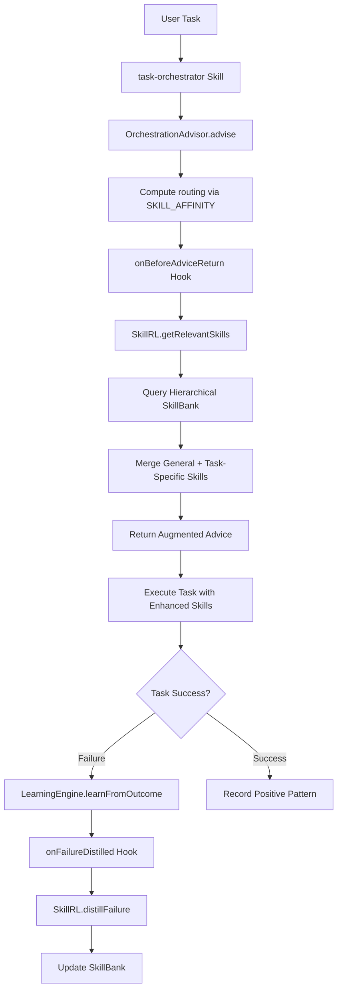
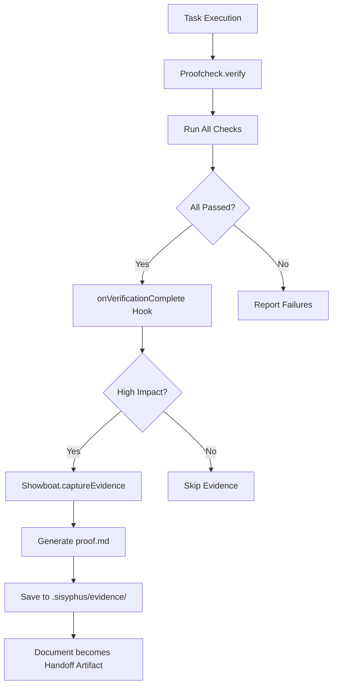

# SkillRL + showboat Integration Map

**Purpose**: Document all API surfaces, extension hooks, and integration points for SkillRL (hierarchical skill orchestration) and showboat (evidence capture) integration into OpenCode.

**Last Updated**: 2026-02-11  
**Status**: Discovery Complete, Hooks Not Yet Implemented

---

## Table of Contents

1. [Package Architecture](#package-architecture)
2. [API Reference](#api-reference)
3. [Extension Hooks](#extension-hooks)
4. [Integration Flow](#integration-flow)
5. [Verification Requirements](#verification-requirements)

---

## Package Architecture

### Existing Packages

#### 1. task-orchestrator (SKILL)
- **Type**: OpenCode skill (markdown-based)
- **Location**: `~/.config/opencode/skills/task-orchestrator/SKILL.md`
- **Purpose**: Orchestrate multi-step tasks through workflow selection
- **Key Workflow**: Normalize → Inventory → Classify → Select Skills → Plan → Execute
- **Integration Point**: Step 3 "Select Skills" - query SkillRL SkillBank

#### 2. opencode-learning-engine (PACKAGE)
- **Type**: Node.js CommonJS package
- **Location**: `~/packages/opencode-learning-engine/`
- **Purpose**: Learn from session logs, detect anti-patterns, provide orchestration advice
- **Exports**:
  - `LearningEngine` (main class)
  - `OrchestrationAdvisor` (routing/skill recommendations)
  - `PatternExtractor` (session log analysis)
  - `AntiPatternCatalog` (anti-pattern storage)
  - `PositivePatternTracker` (positive pattern storage)
  - `AGENT_CAPABILITIES` (agent capability map)
  - `SKILL_AFFINITY` (task→skill affinity map)

#### 3. opencode-proofcheck (PACKAGE)
- **Type**: Node.js CommonJS package
- **Location**: `~/packages/opencode-proofcheck/`
- **Purpose**: Deployment gate - verify before commit/push
- **Exports**:
  - `Proofcheck` (main class)
  - Check functions: `checkGitStatus`, `checkTests`, `checkLint`, `checkSecurity`, `checkBranchSync`
- **Extensibility**: Pluggable checks via `config.checks`

### New Packages (To Be Created)

#### 4. opencode-skill-rl-manager (NEW)
- **Type**: Node.js CommonJS package
- **Location**: `~/packages/opencode-skill-rl-manager/`
- **Purpose**: Implement SkillRL hierarchical skill orchestration
- **Key Components**:
  - `SkillBank` (hierarchical: General + Task-Specific)
  - `SkillSelector` (query skills by task context)
  - `SkillEvolver` (recursive evolution via failure distillation)
  - `SkillRL` (main facade)
- **Based On**: arXiv:2602.08234 (SkillRL paper)

#### 5. opencode-showboat-wrapper (NEW)
- **Type**: Node.js wrapper around showboat CLI
- **Location**: `~/packages/opencode-showboat-wrapper/`
- **Purpose**: Automated evidence capture for high-impact milestones
- **Key Components**:
  - `ShowboatCLI` (wrapper for Go/Python showboat)
  - `EvidenceGate` (determine when to capture evidence)
  - `PlaywrightEvidence` (default: use Playwright assertions)
  - `ShowboatDoc` (generate `.sisyphus/evidence/proof.md`)

---

## API Reference

### LearningEngine

```javascript
class LearningEngine {
  constructor(options = { autoLoad: true })
  
  // Pattern ingestion
  ingestSession(sessionId: string): { 
    session_id: string,
    anti_patterns: AntiPattern[],
    positive_patterns: PositivePattern[]
  }
  
  ingestAllSessions(): {
    sessions_analyzed: number,
    total_anti: number,
    total_positive: number,
    cross_session: CrossSessionPattern[]
  }
  
  // Orchestration advice
  advise(taskContext: TaskContext): Advice
  
  // Outcome learning
  learnFromOutcome(adviceId: string, outcome: Outcome): {
    learned: boolean,
    type: 'positive_pattern' | 'anti_pattern',
    severity?: 'low' | 'medium' | 'high' | 'critical'
  }
  
  // Reporting
  getReport(): Report
  
  // Manual pattern registration
  addAntiPattern(pattern: AntiPattern): void
  addPositivePattern(pattern: PositivePattern): void
}
```

**TaskContext Schema**:
```typescript
interface TaskContext {
  task_type: string;          // debug, refactor, feature, fix, test, etc.
  description?: string;       // Natural language task description
  files?: string[];           // Files likely to be touched
  error_type?: string;        // If fixing an error
  attempt_number?: number;    // Which attempt
  tool?: string;              // Tool being considered
  action?: string;            // Action being considered
  complexity?: 'trivial' | 'simple' | 'moderate' | 'complex' | 'extreme';
}
```

**Advice Schema**:
```typescript
interface Advice {
  advice_id: string;
  warnings: Warning[];        // STRONG - anti-pattern matches
  suggestions: Suggestion[];  // SOFT - positive pattern recommendations
  routing: {
    agent: string;           // explore, librarian, oracle, hephaestus, metis, momus
    skills: string[];        // Max 5 skills
    confidence: number;      // 0.0-1.0
  };
  risk_score: number;
  should_pause: boolean;     // true if risk_score > 15
}
```

### OrchestrationAdvisor

```javascript
class OrchestrationAdvisor {
  constructor(
    antiPatternCatalog?: AntiPatternCatalog,
    positivePatternTracker?: PositivePatternTracker,
    hooks?: AdvisorHooks  // NEW - for SkillRL integration
  )
  
  advise(taskContext: TaskContext): Advice
  learnFromOutcome(adviceId: string, outcome: Outcome): LearnResult
  getInsights(): Insights
}
```

**Agent Capabilities**:
| Agent | Strengths | Task Types |
|-------|-----------|------------|
| explore | code_navigation, codebase_understanding, search | explore, understand, search, find |
| librarian | documentation, knowledge_retrieval, context | document, explain, lookup |
| oracle | analysis, architecture, design_review | review, analyze, design, plan |
| hephaestus | building, implementation, coding | build, implement, create, feature |
| metis | planning, strategy, decomposition | plan, decompose, strategy, complex |
| momus | testing, validation, quality | test, validate, verify, quality |

**Skill Affinity Map**:
```javascript
const SKILL_AFFINITY = {
  debug: ['systematic-debugging', 'test-driven-development'],
  refactor: ['refactor', 'verification-before-completion'],
  feature: ['brainstorming', 'writing-plans', 'executing-plans'],
  fix: ['systematic-debugging'],
  test: ['test-driven-development', 'verification-before-completion'],
  git: ['git-master'],
  browser: ['playwright', 'dev-browser'],
  ui: ['frontend-ui-ux', 'frontend-design'],
  deploy: ['verification-before-completion'],
  plan: ['writing-plans', 'brainstorming'],
  complex: ['dispatching-parallel-agents', 'subagent-driven-development']
};
```

### PatternExtractor

```javascript
class PatternExtractor {
  constructor()
  
  extractFromSession(sessionId: string): SessionPatterns
  extractFromAllSessions(): AllSessionsPatterns
}
```

**Anti-Pattern Types**:
- `shotgun_debug` - Multiple failed edits to same file (>3 edits)
- `inefficient_solution` - High tokens per line changed (>500 tokens/line)
- `type_suppression` - Using `@ts-ignore`, `any`, lint suppressions
- `broken_state` - Consecutive build/test failures (3+ failures)
- `failed_debug` - Same error appearing 3+ times
- `wrong_tool` - Ineffective tool for task (e.g., grep instead of LSP)
- `repeated_mistake` - (Cross-session) Same error across 2+ sessions

**Positive Pattern Types**:
- `efficient_debug` - Fixed in single attempt (read → edit → verify clean)
- `creative_solution` - Using AST-grep or LSP effectively
- `good_delegation` - Using sub-agents effectively
- `fast_resolution` - Task completed in ≤5 messages

### Proofcheck

```javascript
class Proofcheck {
  constructor(config?: {
    cwd?: string;
    checks?: Record<string, CheckFunction>;
    hooks?: ProofcheckHooks;  // NEW - for showboat integration
    timeout?: number;
  })
  
  verify(): Promise<VerificationResult>
  gateDeployment(branch: string): Promise<DeploymentGate>
}
```

**VerificationResult Schema**:
```typescript
interface VerificationResult {
  allPassed: boolean;
  results: CheckResult[];
}

interface CheckResult {
  check: string;
  passed: boolean;
  message: string;
  details?: string;
}
```

**Built-in Checks**:
- `checkGitStatus` - Working tree clean (no uncommitted changes)
- `checkTests` - Run project tests (npm test / pytest)
- `checkLint` - Run linter (npm run lint / ruff / flake8)
- `checkSecurity` - Security audit (npm audit / pip-audit)
- `checkBranchSync` - Branch up-to-date with remote

**Custom Check Function Signature**:
```typescript
type CheckFunction = (opts: { cwd?: string; timeout?: number }) => {
  passed: boolean;
  message: string;
  details?: string;
};
```

---

## Extension Hooks

### OrchestrationAdvisor Hooks (for SkillRL)

**Hook Interface**:
```typescript
interface AdvisorHooks {
  // Called before returning advice - allows SkillRL to augment skill selection
  onBeforeAdviceReturn?: (taskContext: TaskContext, advice: Advice) => Advice;
  
  // Called when failure is distilled - allows SkillRL to update skills
  onFailureDistilled?: (outcome: Outcome, antiPattern: AntiPattern, taskContext: TaskContext) => void;
  
  // Called to determine if evidence should be captured
  shouldCaptureEvidence?: (taskContext: TaskContext, advice: Advice) => boolean;
}
```

**Implementation Location**: `~/packages/opencode-learning-engine/src/orchestration-advisor.js`

**Backward Compatibility**: All hooks have default no-op implementations:
```javascript
this.hooks = {
  onBeforeAdviceReturn: hooks.onBeforeAdviceReturn || ((ctx, adv) => adv),
  onFailureDistilled: hooks.onFailureDistilled || (() => {}),
  shouldCaptureEvidence: hooks.shouldCaptureEvidence || (() => false),
  ...hooks
};
```

**Usage Example**:
```javascript
const { SkillRL } = require('opencode-skill-rl-manager');
const { OrchestrationAdvisor } = require('opencode-learning-engine');

const skillRL = new SkillRL();
const advisor = new OrchestrationAdvisor(null, null, {
  onBeforeAdviceReturn: (ctx, advice) => {
    // Query SkillRL for task-specific skills
    const rlSkills = skillRL.getRelevantSkills(ctx);
    advice.routing.skills = [...new Set([...advice.routing.skills, ...rlSkills])];
    return advice;
  },
  onFailureDistilled: (outcome, antiPattern, ctx) => {
    // Update SkillRL knowledge base
    skillRL.distillFailure(antiPattern, ctx);
  }
});
```

### Proofcheck Hooks (for showboat)

**Hook Interface**:
```typescript
interface ProofcheckHooks {
  // Called after verification completes - trigger evidence capture if high-impact
  onVerificationComplete?: (result: VerificationResult) => Promise<void>;
  
  // Called to generate showboat evidence document
  captureEvidence?: (taskContext: TaskContext, verification: VerificationResult) => Promise<string | null>;
}
```

**Implementation Location**: `~/packages/opencode-proofcheck/src/index.js`

**Backward Compatibility**: All hooks have default no-op implementations:
```javascript
this.hooks = {
  onVerificationComplete: config.hooks?.onVerificationComplete || (async () => {}),
  captureEvidence: config.hooks?.captureEvidence || (async () => null),
  ...config.hooks
};
```

**Usage Example**:
```javascript
const { Showboat } = require('opencode-showboat-wrapper');
const { Proofcheck } = require('opencode-proofcheck');

const showboat = new Showboat();
const proofcheck = new Proofcheck({
  hooks: {
    onVerificationComplete: async (result) => {
      if (result.allPassed && showboat.isHighImpact(taskContext)) {
        await showboat.captureEvidence({
          outputPath: '.sisyphus/evidence/proof.md',
          verification: result
        });
      }
    }
  }
});
```

### task-orchestrator Extension (for SkillRL)

**Integration Point**: Step 3 "Select Skills"

**Current Workflow**:
```markdown
### 3) Select Skills (Mandatory)

Process skills first:
- brainstorming / systematic-debugging / test-driven-development / verification-before-completion

Then domain skills (from SKILL_AFFINITY):
- frontend-design, git-worktree, rclone, dspy-ruby, agent-browser, etc.
```

**Extended Workflow**:
```markdown
### 3) Select Skills (Mandatory)

Process skills first:
- brainstorming / systematic-debugging / test-driven-development / verification-before-completion

**THEN Query SkillRL SkillBank**:
- Call `SkillRL.getRelevantSkills(taskContext)` to query hierarchical bank (General + Task-Specific)
- Merge with SKILL_AFFINITY suggestions
- Deduplicate and rank by relevance score

Then domain skills:
- frontend-design, git-worktree, rclone, dspy-ruby, agent-browser, etc.
```

**Note**: task-orchestrator is a skill (markdown), not code. Integration happens via:
1. OrchestrationAdvisor hook (augments advice before return)
2. Agent following task-orchestrator workflow queries OrchestrationAdvisor
3. OrchestrationAdvisor invokes SkillRL via hook

---

## Integration Flow

### SkillRL Integration Flow



**Key Steps**:
1. **Advice Augmentation**: SkillRL augments skill selection via `onBeforeAdviceReturn` hook
2. **Hierarchical Query**: SkillRL queries General skills first, then Task-Specific skills
3. **Failure Distillation**: On failure, SkillRL updates skills via `onFailureDistilled` hook
4. **Recursive Evolution**: SkillRL evolves skills based on failure root cause analysis

### showboat Integration Flow



**Key Steps**:
1. **Verification Gate**: Proofcheck runs all checks (git, tests, lint, security, branch sync)
2. **High-Impact Filter**: Only capture evidence at major milestones (not every file edit)
3. **Playwright Default**: Use Playwright assertions (text, element, accessibility) for visual verification
4. **Handoff Artifact**: Generated `proof.md` becomes primary handoff document between machines

**High-Impact Criteria** (examples):
- Task complexity is "complex" or "extreme"
- Task involves deployment (commit, PR, merge)
- Task modifies core architecture files
- Task affects >10 files
- Manual override flag set

---

## Verification Requirements

### All Hooks Must

1. ✅ **Maintain Backward Compatibility**: All hooks optional with no-op defaults
2. ✅ **Pass Existing Tests**: `bun test packages/opencode-learning-engine/` and `bun test packages/opencode-proofcheck/`
3. ✅ **Document Interfaces**: README files updated with hook documentation
4. ✅ **Type Safety**: JSDoc comments for all hook signatures
5. ✅ **Error Handling**: Hooks must not crash if integration package missing

### Test Coverage Required

#### learning-engine Hook Tests
```javascript
// Test onBeforeAdviceReturn hook
test('onBeforeAdviceReturn hook augments advice', () => {
  const advisor = new OrchestrationAdvisor(null, null, {
    onBeforeAdviceReturn: (ctx, adv) => {
      adv.routing.skills.push('custom-skill');
      return adv;
    }
  });
  const advice = advisor.advise({ task_type: 'debug' });
  assert(advice.routing.skills.includes('custom-skill'));
});

// Test onFailureDistilled hook
test('onFailureDistilled hook called on failure', () => {
  let called = false;
  const advisor = new OrchestrationAdvisor(null, null, {
    onFailureDistilled: () => { called = true; }
  });
  const advice = advisor.advise({ task_type: 'debug' });
  advisor.learnFromOutcome(advice.advice_id, { success: false });
  assert(called === true);
});
```

#### proofcheck Hook Tests
```javascript
// Test onVerificationComplete hook
test('onVerificationComplete hook called after verify', async () => {
  let called = false;
  const proofcheck = new Proofcheck({
    hooks: {
      onVerificationComplete: async () => { called = true; }
    }
  });
  await proofcheck.verify();
  assert(called === true);
});
```

### Manual Verification Checklist

- [ ] Run `bun test` in `opencode-learning-engine` - all tests pass
- [ ] Run `bun test` in `opencode-proofcheck` - all tests pass
- [ ] Verify hooks are optional (packages work without SkillRL/showboat)
- [ ] Verify hook errors don't crash main packages
- [ ] Document all hooks in package README files
- [ ] Create integration examples in `examples/` directory

---

## Implementation Status

### Task 1: Discovery & Refactoring ✅
- [x] Confirm task-orchestrator is skill, not package
- [x] Map learning-engine exports
- [x] Map proofcheck exports
- [ ] Add extension hooks to orchestration-advisor.js
- [ ] Add extension hooks to proofcheck/index.js
- [ ] Create docs/architecture/integration-map.md (THIS FILE)
- [ ] Verify hooks via `bun test`
- [ ] Mark Task 1 complete in plan file

### Task 2: Build opencode-skill-rl-manager ⏳ Pending
- [ ] Implement Hierarchical SkillBank (General + Task-Specific)
- [ ] Build SkillSelector (query by task context)
- [ ] Build SkillEvolver (recursive evolution via failure distillation)
- [ ] Create SkillRL facade class
- [ ] Tests: `bun test packages/opencode-skill-rl-manager/tests/selection.test.ts`

### Task 3: Build opencode-showboat-wrapper ⏳ Pending
- [ ] Create ShowboatCLI wrapper
- [ ] Implement EvidenceGate (high-impact filtering)
- [ ] Set Playwright assertions as default
- [ ] Generate `.sisyphus/evidence/proof.md`
- [ ] Tests: Verify proof.md content

### Task 4: Core Integration ⏳ Pending
- [ ] Hook SkillRL into OrchestrationAdvisor
- [ ] Hook showboat into Proofcheck
- [ ] Wire failure distillation into LearningEngine

### Task 5: Final E2E & Documentation ⏳ Pending
- [ ] E2E test: task → SkillRL → showboat → handoff
- [ ] Update COMPLETE-INVENTORY.md
- [ ] Update INTEGRATION-GUIDE.md
- [ ] Run `bun test integration-tests/skillrl-showboat-e2e.test.ts`

---

## References

- **SkillRL Paper**: arXiv:2602.08234 - Hierarchical Skill Learning via RL Principles
- **showboat Repo**: https://github.com/simonw/showboat - Executable markdown evidence docs
- **showboat Demos**: https://github.com/simonw/showboat-demos - Example proof documents
- **SkillRL Repo**: https://github.com/aiming-lab/SkillRL - Official implementation (pending)

---

**Document Version**: 1.0  
**Last Updated**: 2026-02-11  
**Maintained By**: Atlas (OpenCode orchestrator)
