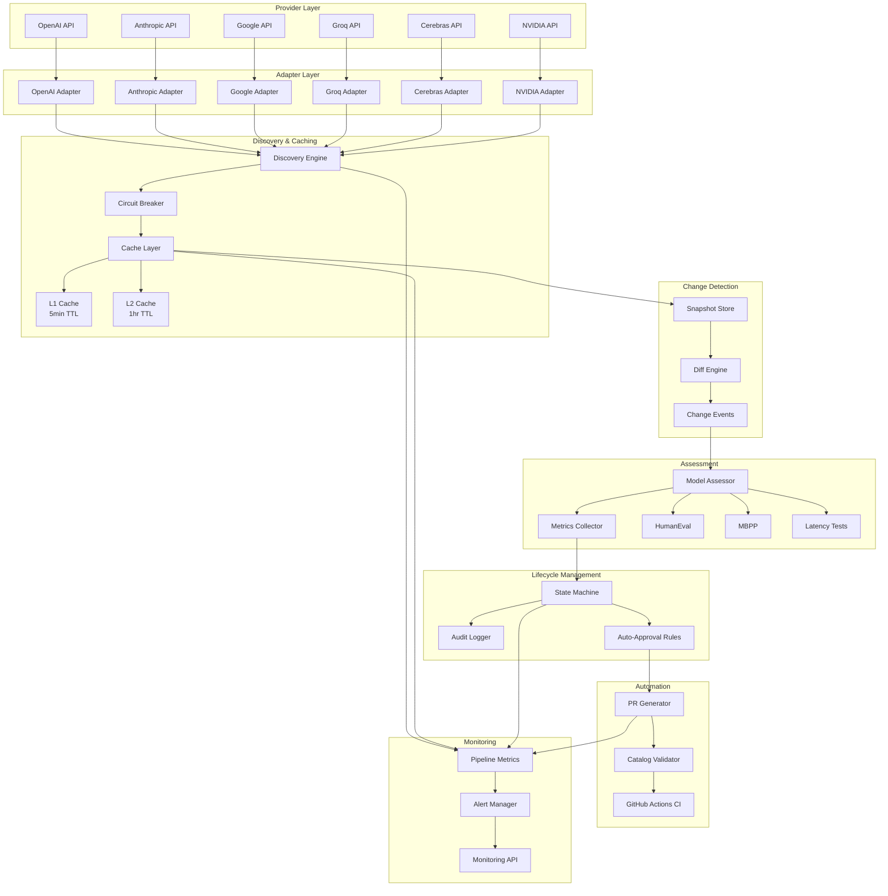
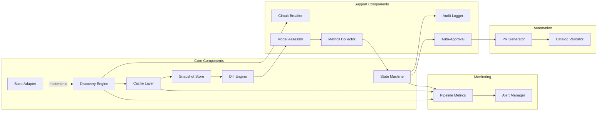
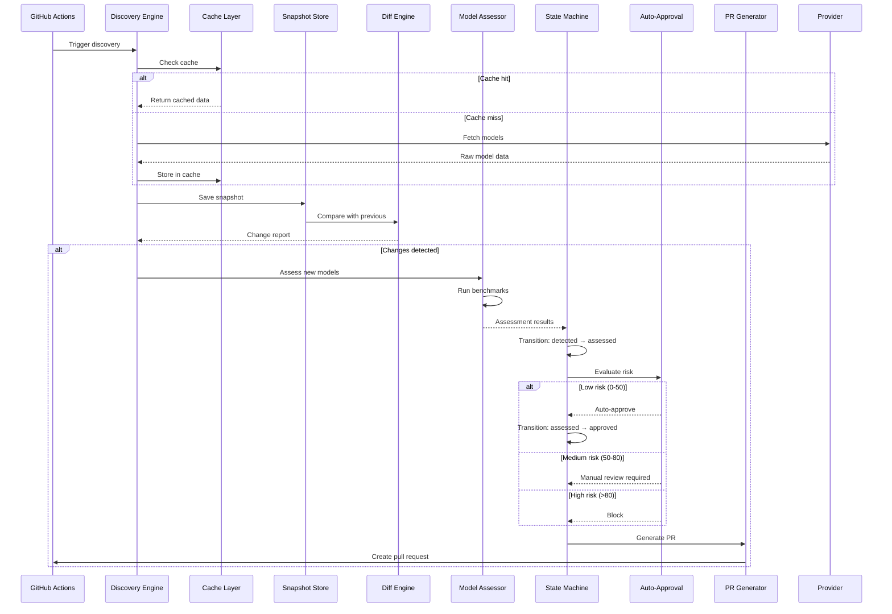
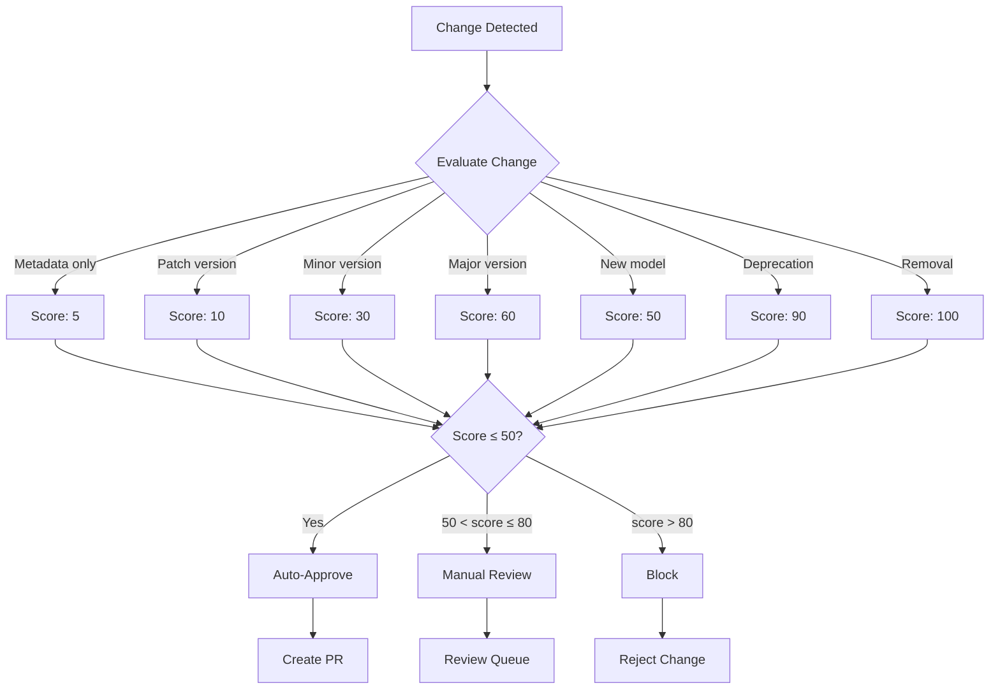
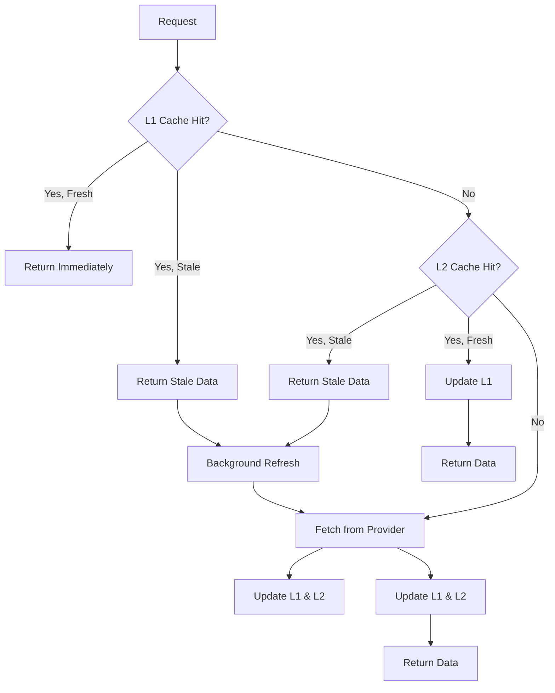
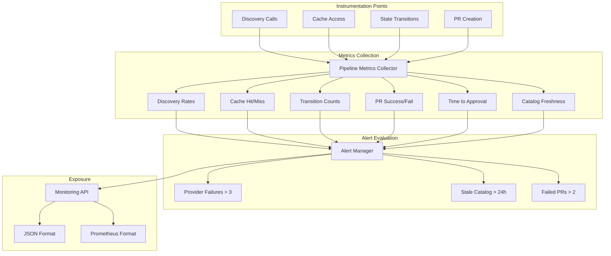
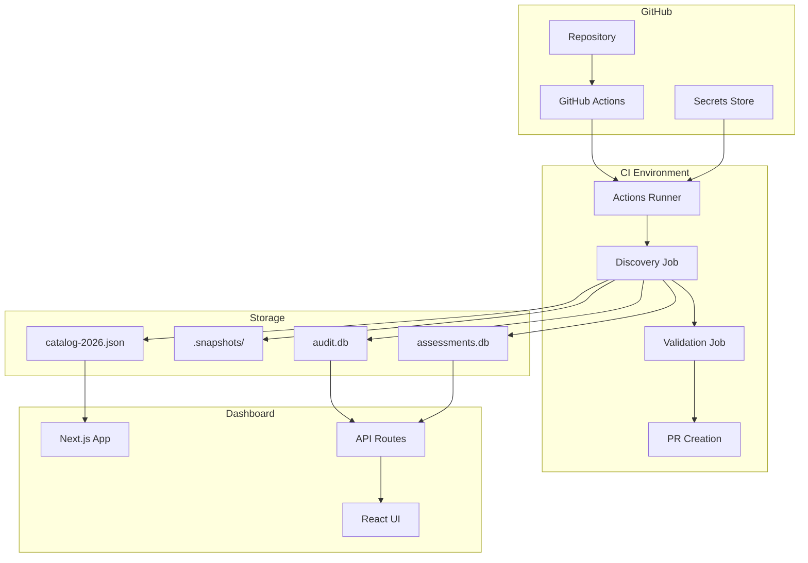

# Model Management System Architecture

## Overview

The OpenCode Model Management System is an automated pipeline that discovers, validates, assesses, and integrates AI models from 6 providers (OpenAI, Anthropic, Google, Groq, Cerebras, NVIDIA) with minimal human intervention while maintaining safety and reliability.

**Key Capabilities:**
- Automated model discovery from multiple providers
- Two-tier caching for performance
- Change detection and diff analysis
- Real benchmark-based assessment
- 5-state lifecycle management
- Risk-based auto-approval
- Automated PR generation
- Complete audit trail

## System Architecture



## Component Diagram



## Data Flow



## Technology Stack

### Core Technologies
- **Runtime**: Node.js (ESM + CJS modules)
- **Test Framework**: Bun test
- **Database**: SQLite (better-sqlite3)
- **CI/CD**: GitHub Actions
- **API**: Next.js API routes

### Storage Strategy

| Data Type | Storage | Retention | Rationale |
|-----------|---------|-----------|-----------|
| Snapshots | JSON files | 30 days | Simple, portable, version-controllable |
| Audit logs | SQLite | 1 year | Queryable, tamper-evident hash chain |
| Assessments | SQLite | Permanent | Historical quality metrics |
| Monitoring | In-memory | 24 hours | Ephemeral, high-performance |
| Cache L1 | In-memory | 5 minutes | Ultra-fast access |
| Cache L2 | JSON files | 1 hour | Persistent across restarts |

### Provider Integration

| Provider | API Endpoint | Auth Method | Pagination |
|----------|--------------|-------------|------------|
| OpenAI | `/v1/models` | Bearer token | None (single page) |
| Anthropic | `/v1/models` | x-api-key header | Cursor-based (after_id) |
| Google | `/v1beta/models` | Query param (?key=) | None (single page) |
| Groq | `/openai/v1/models` | Bearer token | None (single page) |
| Cerebras | `/v1/models` | Bearer token | None (single page) |
| NVIDIA | `/v1/models` | Bearer token | None (single page) |

## Lifecycle States

```mermaid
stateDiagram-v2
    [*] --> detected: Discovery finds new model
    detected --> assessed: Benchmarks complete
    assessed --> approved: Auto-approval or manual
    approved --> selectable: Added to catalog
    selectable --> default: Promoted by admin
    
    assessed --> detected: Assessment fails
    approved --> assessed: Approval revoked
    selectable --> approved: Removed from catalog
    default --> selectable: Demoted
    
    note right of detected
        Model discovered
        Awaiting assessment
    end note
    
    note right of assessed
        Benchmarks complete
        Metrics collected
    end note
    
    note right of approved
        Human/auto-approved
        Ready for catalog
    end note
    
    note right of selectable
        Appears in UI
        Users can select
    end note
    
    note right of default
        Default for intent
        or category
    end note
```

## Risk Scoring



## Caching Strategy



## Monitoring Architecture



## Security Model

### Authentication
- Provider API keys stored in GitHub Secrets
- No keys in code or configuration files
- Rotation handled externally

### Audit Trail
- Every state transition logged
- Hash chain prevents tampering
- Includes: timestamp, actor, reason, diff hash
- 1-year retention

### Approval Gates
- No automatic promotion to `default` state
- High-risk changes (score > 80) blocked
- Manual review required for medium-risk (50-80)
- Complete audit trail for all approvals

### Validation Pipeline
- Schema validation
- Duplicate detection
- Forbidden pattern checks
- Required field verification
- Timestamp validation

## Performance Characteristics

| Operation | Target | Actual | Notes |
|-----------|--------|--------|-------|
| Discovery (all providers) | < 10s | ~8s | Parallel execution |
| L1 Cache Hit | < 1ms | < 1ms | In-memory |
| L2 Cache Hit | < 10ms | ~5ms | JSON file read |
| Assessment (per model) | < 5min | ~3min | Real benchmarks |
| Diff Accuracy | > 95% | 100% | Classification accuracy |
| Rollback Time | < 5min | ~10s | File restore + validation |

## Scalability Considerations

### Current Limits
- 6 providers (hardcoded)
- ~50 models per provider
- 30-day snapshot retention
- 1-year audit retention
- 24-hour monitoring retention

### Future Scaling
- Provider registry for dynamic addition
- Sharded snapshot storage
- Distributed caching
- Streaming assessment results
- Real-time monitoring dashboards

## Deployment Architecture



## References

- [README](../../packages/opencode-model-manager/README.md) - Quick start and usage
- [API Reference](./API-REFERENCE.md) - Detailed API documentation
- [Operations Guide](./OPERATIONS.md) - Operational procedures
- [Troubleshooting](./TROUBLESHOOTING.md) - Common issues and solutions
- [Implementation Summary](../../.sisyphus/MODEL-MANAGEMENT-SUMMARY.md) - Complete implementation details
