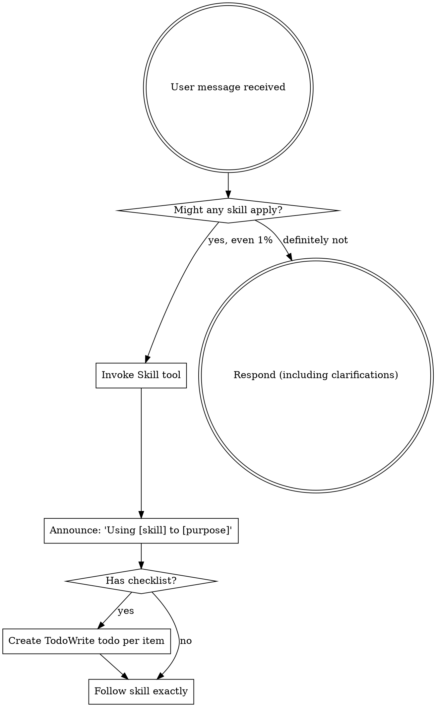

<EXTREMELY-IMPORTANT>
If you think there is even a 1% chance a skill might apply to what you are doing, you ABSOLUTELY MUST invoke the skill.

IF A SKILL APPLIES TO YOUR TASK, YOU DO NOT HAVE A CHOICE. YOU MUST USE IT.

This is not negotiable. This is not optional. You cannot rationalize your way out of this.
</EXTREMELY-IMPORTANT>

## How to Access Skills

**In Claude Code:** Use the `Skill` tool. When you invoke a skill, its content is loaded and presented to you—follow it directly. Never use the Read tool on skill files.

**In other environments:** Check your platform's documentation for how skills are loaded.

# Using Skills

## The Rule

**Invoke relevant or requested skills BEFORE any response or action.** Even a 1% chance a skill might apply means that you should invoke the skill to check. If an invoked skill turns out to be wrong for the situation, you don't need to use it.

## Red Flags

These thoughts mean STOP—you're rationalizing:

| Thought | Reality |
|---------|---------|
| "This is just a simple question" | Questions are tasks. Check for skills. |
| "I need more context first" | Skill check comes BEFORE clarifying questions. |
| "Let me explore the codebase first" | Skills tell you HOW to explore. Check first. |
| "I can check git/files quickly" | Files lack conversation context. Check for skills. |
| "Let me gather information first" | Skills tell you HOW to gather information. |
| "This doesn't need a formal skill" | If a skill exists, use it. |
| "I remember this skill" | Skills evolve. Read current version. |
| "This doesn't count as a task" | Action = task. Check for skills. |
| "The skill is overkill" | Simple things become complex. Use it. |
| "I'll just do this one thing first" | Check BEFORE doing anything. |
| "This feels productive" | Undisciplined action wastes time. Skills prevent this. |
| "I know what that means" | Knowing the concept ≠ using the skill. Invoke it. |

## Profile-Based Skill Loading

For common task patterns, use **profiles** to load a curated skill subset instead of scanning all skills. Profiles are faster and reduce cognitive overhead.

| Profile | When to use | Skills loaded |
|---------|-------------|---------------|
| `deep-refactoring` | refactor / clean up / improve architecture | TDD + systematic-debugging + git-master + verification |
| `planning-cycle` | plan feature / design system / architect | brainstorming + writing-plans + executing-plans |
| `review-cycle` | code review / PR review | requesting + receiving code review + verification |
| `parallel-implementation` | parallel work / divide and conquer | dispatching-parallel-agents + subagent + executing-plans |
| `browser-testing` | test UI / browser test / visual verification | dev-browser + frontend-ui-ux + verification |
| `diagnostic-healing` | diagnose / fix bug / heal / incident | code-doctor + systematic-debugging + incident-commander + git-master |
| `research-to-code` | research and build / investigate + implement | research-builder + writing-plans + executing-plans |

**Rule**: If the task trigger matches a profile, invoke only those skills — do not load the full skill set.

## Skill Priority

When multiple skills could apply, use this order:

1. **Profile match first** — if a profile fits, load its skills directly
2. **Process skills next** (brainstorming, debugging) - these determine HOW to approach the task
3. **Implementation skills last** (frontend-design, mcp-builder) - these guide execution

"Let's build X" → brainstorming first, then implementation skills.
"Fix this bug" → diagnostic-healing profile → systematic-debugging first, then domain-specific skills.

## Skill Types

**Rigid** (TDD, debugging): Follow exactly. Don't adapt away discipline.

**Flexible** (patterns): Adapt principles to context.

The skill itself tells you which.

## User Instructions

Instructions say WHAT, not HOW. "Add X" or "Fix Y" doesn't mean skip workflows.

## Overview

Summarize what this skill does, when it is useful, and what outcome it should produce.

## When to Use

Use this skill when its description matches the task domain and it provides a safer or more structured workflow than ad-hoc execution.

## Inputs Required

- Task objective
- Relevant files or modules
- Constraints and success criteria

## Workflow

Follow the workflow described in this skill's existing process/phases. Keep steps explicit and verification-first.

## Must Do

- Follow the skill workflow in order
- Validate outputs before handoff
- Surface assumptions and risks

## Must Not Do

- Skip verification gates
- Make destructive changes without explicit requirements
- Hide uncertainty

## Handoff Protocol

**Receives From**: Orchestrator or upstream skill

**Hands Off To**: Downstream execution/review skill with evidence and open risks

## Output Contract

Return concise, structured output with: decisions made, evidence used, unresolved risks, and next step.

## Quick Start

1. Confirm this skill is the right match
2. Gather required inputs
3. Execute workflow
4. Verify and hand off
